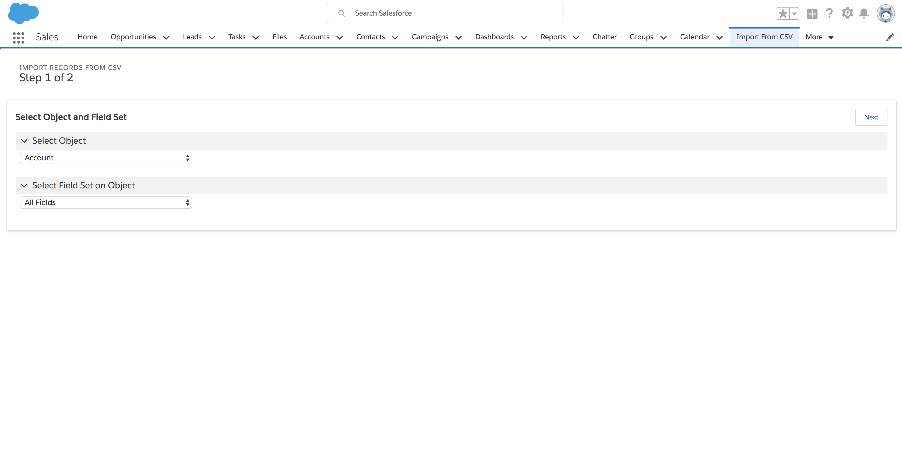
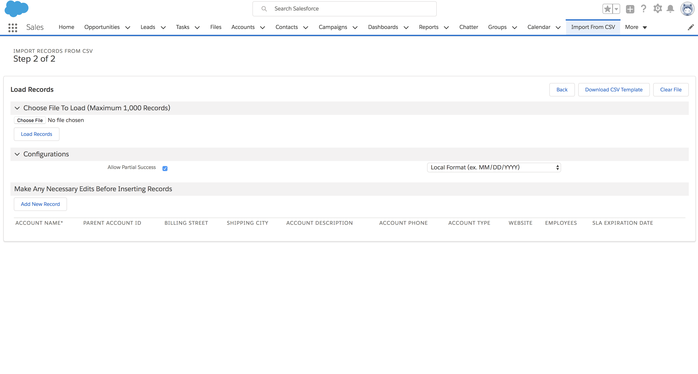

# Import CSV Page

Visualforce Page that allows ad-hoc record creation for create-able objects to the logged in users and also allows importing records from CSVs using fieldsets as the import mapping template

## Setup

### Adding Permissions for Using the Import CSV Tab

1. Navigate to Setup
2. Search in Quick Find for **Permission Sets**, click the link
3. In the Permission Sets page, click on the **Import CSV Page Permissions** permission set
4. Click the Manage Assignments button
5. Assign the Permission Set to any Users needing to see the pages.
6. Any Users with the Permission Set can now add the **Import from CSV** tab to their apps or view the tab in the App Launcher

### Creating Fieldsets for Objects

#### This section must be done in Salesforce Classic because Fieldsets are currently (as of June 2018) only editable in Salesforce Classic

1. Switch to Salesforce Classic
2. Navigate to Setup
3. Navigate to the Field Sets Section
    * Standard Objects
        * Go to **Setup** > **Customize** > **(Object Name)** > **Field Sets**
    * Custom Objects
        * Go to **Setup** > **Create**
            1. Select the Object Name in the Page listing all Custom Objects
            2. Scroll down to **Field Sets**
4. Name the field set and populate other required fields
5. Drag the fields for the fieldset onto the section under the list of fields
    * Marking the Field as **Required** will add an asterisk to the Import CSV Page column for that field
    * The order of the fields in the fieldset determine the order of the columns in the Import CSV Page
6. Field Sets created will be available in Step 1 on the Import CSV Page for that Object

## Usage

### Summary Steps

1. Choosing the SObject and set of fields to use when inserting records
2. Inserting records for the SObject the following ways:
    1. Loading a file with the records
    2. Adding a record to the page and populating the fields manually

### Step 1 of 2: Choosing the SObject and Set of Fields

* The SObjects displayed in the list are filtered by whether the logged in User can create records of that SObject
* Once the SObject is selected, the set of field list is determined by the FieldSets created for that SObject. The default options is the set of all fields that are creatable by the logged in User.

### Step 2 of 2: Inserting records for the SObject

* Available Actions:
    * Choose File
        * Accepts CSV files
    * Load Records
        * Transforms the CSV file loaded into records that can be edited manually later
    * Download CSV Template
        * Starts a CSV file download onto your computer with the headers for the fields in context prepopulated
        * Required fields in the field set are marked with an asterisk in the file
        * You can then add record information into the file and then load that file into the page
    * Clear File
        * Clears the loaded file on the page
    * Add New Record
        * Adds a new record to the record table with default field values populated
* Configuration Details
    * Allow Partial Success
        * If Checked
            * Page tries to insert as many records individually as possible, any errors to any records are recorded next to the 'Remove' button in red text and the successfully inserted records are removed from the table
        * If Unchecked
            * Page attempts to load the entire set of records at the same time, no records are removed from the table if there's any errors and the error message is displayed at the top of the screen.
    * Date Format Options
        * Options:
            * Local Format
                * Best if used from files edited in Excel
                * Assumes the dates loaded are in the format with backslashes in MM/DD/YYYY format, ex. 05/05/2018
        * System Format
            * Best if used from files edited in text editors or system generated
            * Assumes the dates loaded are in the format with dashes and in YYYY-MM-DD format, ex. 2018-05-05
* Limits
    * Page displays that the maximum is 1,000 but the maximum can also be less if the view state of the page is exceeded. Please break up file sizes accordingly to the amount of fields populated and records attempting to be inserted.

### Additional Details

* Works in Classic and in Lightning
